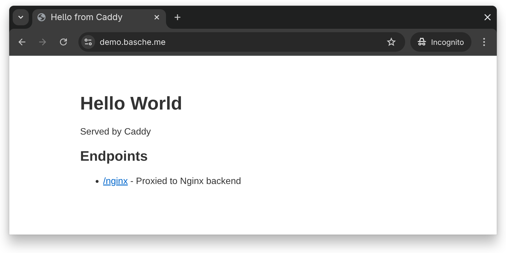
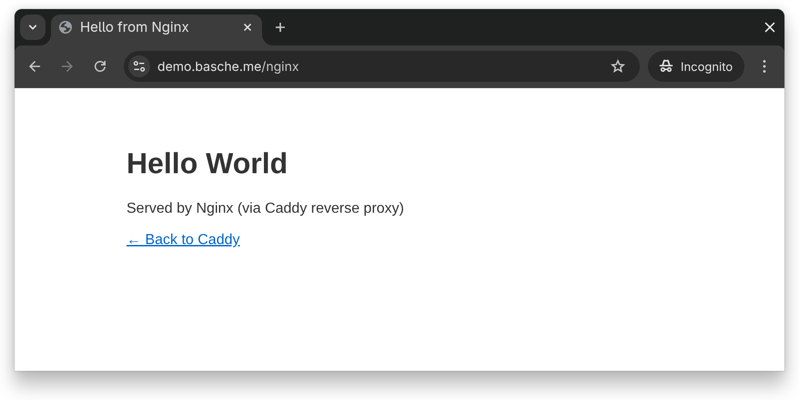
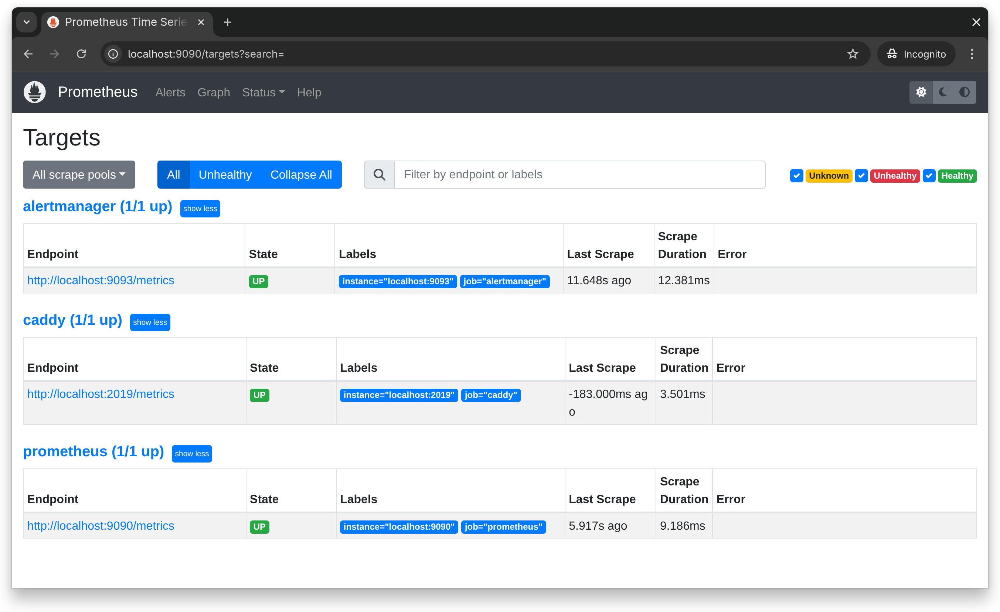
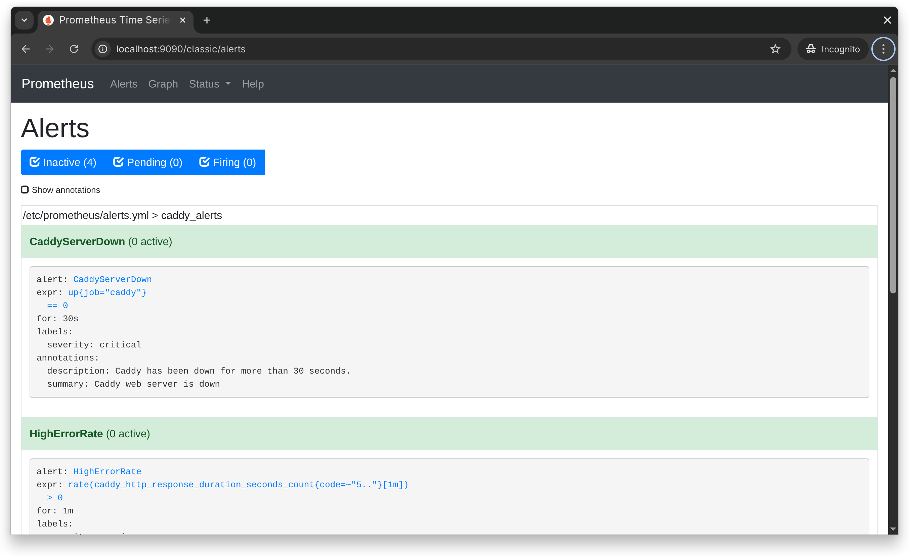

# Caddy + Prometheus Monitoring Stack

Ansible playbook for deploying a web server with monitoring and alerting.

**Demo:** https://demo.basche.me

## Usage
```bash
# Full stack
ansible-playbook -i inventory.yml site.yml --ask-become

# Individual components
ansible-playbook -i inventory.yml playbook.yml --tags caddy --ask-become
ansible-playbook -i inventory.yml playbook.yml --tags monitoring --ask-become
```

## Requirements

- Ubuntu 24.04 (tested) 
- Ansible 2.9+

## Infrastructure

**web01** (Caddy, Prometheus, Alertmanager)
- Public: 443 (HTTPS), 22 (SSH)
- Prometheus/Alertmanager bound to localhost only

**web02** (Nginx backend)
- Public: 22 (SSH)
- HTTP only via internal network (192.168.121.0/24)
- No public web traffic - all requests proxied through Caddy

**Traffic flow:** Client → HTTPS (TLS termination) → web01 (Caddy) → internal network → web02 (Nginx)

## Components

- **Caddy** - Web server with automatic HTTPS, reverse proxy
- **Nginx** - Backend server (internal network only)
- **Prometheus** - Metrics collection from Caddy (every 5s)
- **Alertmanager** - Alert routing

## Monitoring

Prometheus scrapes Caddy metrics from localhost:2019/metrics including:
- HTTP response codes
- Request latency
- Server uptime

## Alerts

- `CaddyServerDown` - Server unreachable for 30s
- `HighErrorRate` - HTTP 5xx errors detected
- `SlowResponses` - Latency > 500ms
- `HighRequestRate` - More than 100 req/sec

**Note:** Alertmanager webhook points to localhost:5001 as placeholder. In production, configure email/Slack/PagerDuty.

## Design Decisions

**Internal network for backend** - web02 has no public HTTP port. Caddy on web01 terminates SSL and proxies to Nginx internally. Reduces attack surface.

**Minimal firewall rules** - Only necessary ports exposed. Prometheus and Alertmanager not reachable from outside. (Configured via Gridscale Cloud Panel)

**Path-based routing** - `/nginx` routes to backend. Simple to verify and debug.

**Security headers** - HSTS, X-Content-Type-Options, X-Frame-Options enabled in Caddy.

**Health checks** - Caddy checks backend availability every 10s. Marks backend down after 3 consecutive failures.

**Ansible tags** - Allows partial deployments (`--tags caddy`, `--tags monitoring`).

## Files
```
├── site.yml              # Main entrypoint
├── playbook.yml          # Caddy, Prometheus, Alertmanager
├── nginx.yml             # Nginx backend
├── inventory.yml
└── templates/
    ├── Caddyfile.j2
    ├── index.html.j2
    ├── nginx-index.html.j2
    ├── prometheus.yml.j2
    ├── alerts.yml.j2
    └── alertmanager.yml.j2
```

## Screenshots

### Web Server


### Reverse Proxy


### Prometheus Targets


### Prometheus Alerts


## Verification
```bash
# Caddy
curl -I https://demo.basche.me

# Nginx via reverse proxy
curl https://demo.basche.me/nginx

# Prometheus (via SSH tunnel)
ssh -L 9090:localhost:9090 root@web01.basche.me
# http://localhost:9090/targets
# http://localhost:9090/alerts
```
